# 📘 HƯỚNG DẪN SỬ DỤNG MONITORBOT

## 🎯 Giới Thiệu

**MonitorBot** là phần mềm giám sát tự động các nhóm Telegram và tự động gọi điện cảnh báo khi phát hiện sự cố hệ thống.

### Tính Năng Chính:
- ✅ Giám sát nhiều nhóm Telegram đồng thời
- ✅ Tự động phát hiện sự cố dựa trên tin nhắn
- ✅ Gọi điện tự động khi có cảnh báo
- ✅ Gửi SMS thông báo với nội dung tùy chỉnh
- ✅ Quản lý danh bạ liên hệ theo nhóm
- ✅ Điều khiển từ xa qua Telegram Bot
- ✅ Xem lịch sử hoạt động chi tiết

---

## 📋 Mục Lục

1. [Cài Đặt Ban Đầu](#1-cài-đặt-ban-đầu)
2. [Giao Diện Chính](#2-giao-diện-chính)
3. [Khởi Động và Dừng Giám Sát](#3-khởi-động-và-dừng-giám-sát)
4. [Quản Lý Cấu Hình Nhóm](#4-quản-lý-cấu-hình-nhóm)
5. [Quản Lý Danh Bạ](#5-quản-lý-danh-bạ)
6. [Xem Chi Tiết Nhóm](#6-xem-chi-tiết-nhóm)
7. [Xem Log](#7-xem-log)
8. [Cấu Hình Điện Thoại](#8-cấu-hình-điện-thoại)
9. [Điều Khiển Từ Xa qua TeleBot](#9-điều-khiển-từ-xa-qua-telebot) 🆕
10. [Xử Lý Sự Cố](#10-xử-lý-sự-cố)

---

## 1. Cài Đặt Ban Đầu

### 1.1. Yêu Cầu Hệ Thống
- **Hệ điều hành**: Windows 10/11
- **RAM**: Tối thiểu 4GB
- **Dung lượng**: 100MB trống
- **Kết nối**: Internet ổn định
- **Điện thoại Android** (nếu dùng tính năng gọi điện):
  - USB Debugging đã bật
  - Kết nối qua cáp USB

### 1.2. Cài Đặt Phần Mềm

#### Bước 1: Giải Nén File
1. Tải file `MonitorBot.zip`
2. Giải nén vào thư mục `C:\MonitorBot`

#### Bước 2: Cấu Hình Telegram
1. Mở file `appsettings.json` bằng Notepad
2. Tìm section `ClientConfig`:
```json
"ClientConfig": {
  "ApiId": 12345678,
  "ApiHash": "your_api_hash_here",
  "PhoneNumber": "+84xxxxxxxxx",
  "SessionPath": "telegram_session.dat"
}
``` 

#### Bước 3: Chạy Lần Đầu
1. Chạy file `MonitorBot.exe`
2. Nhập mã xác thực từ Telegram (nếu được hỏi)
3. Nhập mật khẩu 2FA (nếu có)
4. Chờ đăng nhập thành công

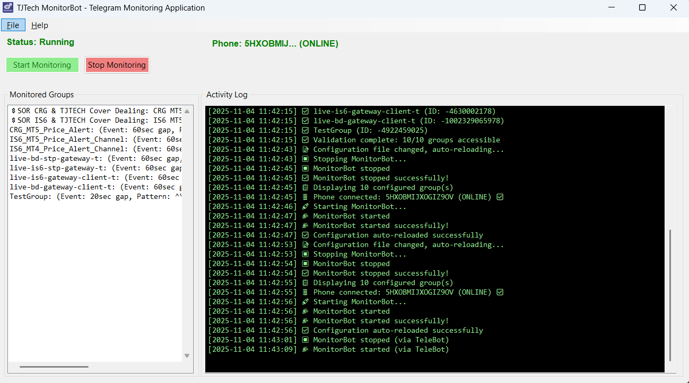
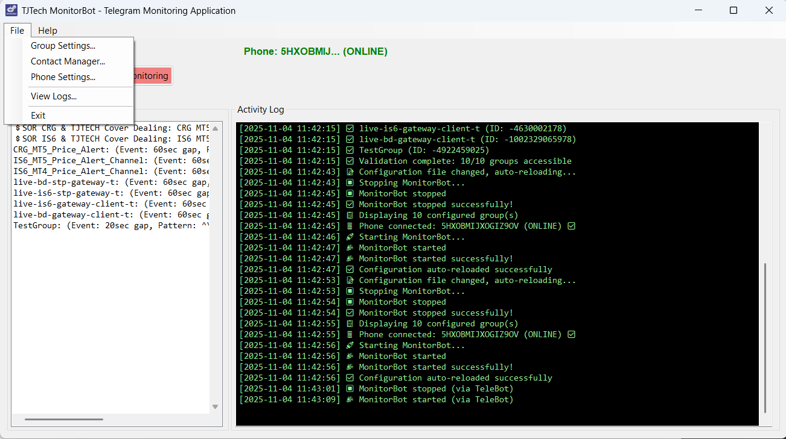
*Giao diện chính của MonitorBot sau khi khởi động*

✅ **Lưu ý**: Chỉ cần đăng nhập 1 lần, lần sau sẽ tự động đăng nhập.

---

## 2. Giao Diện Chính

### 2.1. Thanh Trạng Thái (Status Bar)

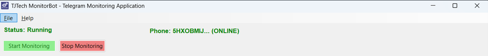

- **Status**: Trạng thái giám sát (Running/Stopped)
- **Phone**: Trạng thái điện thoại Android
- **Groups**: Số nhóm đang giám sát

### 2.2. Danh Sách Nhóm (Monitored Groups)

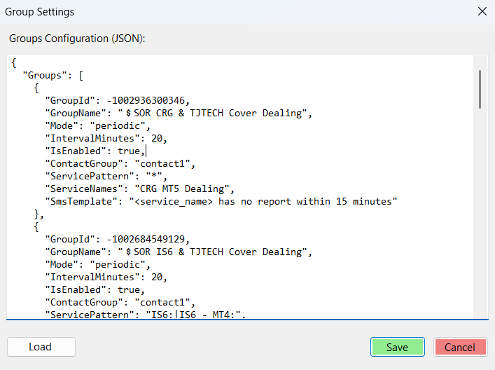

- Click đúp vào nhóm để xem chi tiết
- Tự động cập nhật khi thay đổi cấu hình

### 2.3. Activity Log

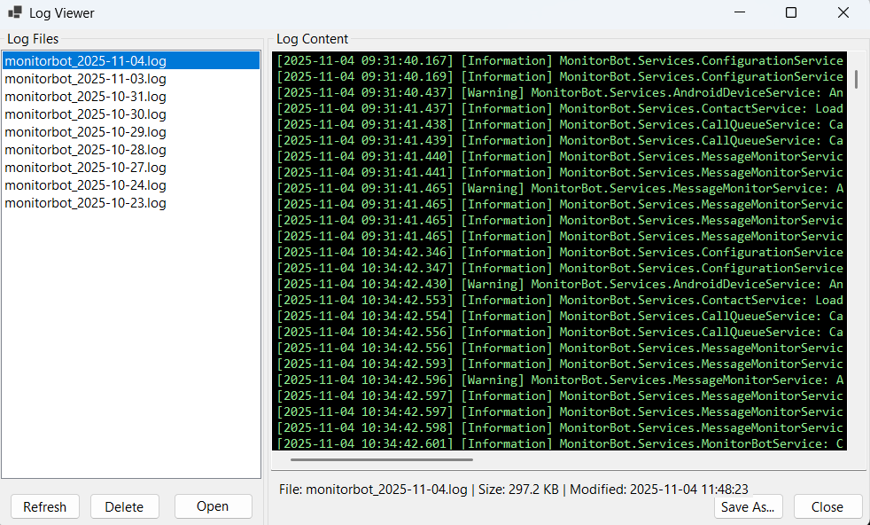

Log hiển thị tất cả các hoạt động của MonitorBot theo thời gian thực.

### 2.4. Các Nút Điều Khiển

| Nút | Chức Năng |
|-----|-----------|
| **Start Monitoring** | Bắt đầu giám sát |
| **Stop Monitoring** | Dừng giám sát |
| **Exit** | Thoát chương trình |

---

## 3. Khởi Động và Dừng Giám Sát

### 3.1. Khởi Động Giám Sát

#### Cách 1: Sử Dụng Nút
1. Click nút **"Start Monitoring"**
2. Chờ kết nối Telegram
3. Xem log hiển thị "MonitorBot started successfully! 🎉"


#### Cách 2: Menu
1. Menu **File** → **Start Monitoring**

#### Cách 3: System Tray
1. Right-click icon trong system tray
2. Chọn **"Start Monitoring"**

#### Cách 4: Qua TeleBot (Remote) 🆕
1. Mở Telegram
2. Tìm bot của bạn
3. Gửi `/menu`
4. Click "▶️ Start Monitoring"

### 3.2. Dừng Giám Sát

Tương tự như khởi động, có thể dừng qua:
- Nút "Stop Monitoring" trong UI
- Menu File → Stop Monitoring
- System tray menu
- **TeleBot**: `/menu` → "⏹️ Stop Monitoring"


---

## 9. Điều Khiển Từ Xa qua TeleBot

### 9.1. Giới Thiệu TeleBot

**TeleBot** cho phép bạn điều khiển MonitorBot từ xa qua Telegram, bất kỳ lúc nào, bất kỳ đâu.

**Tính năng:**
- ✅ Start/Stop monitoring từ xa
- ✅ Xem trạng thái real-time
- ✅ Xem danh sách groups
- ✅ Enable/Disable groups
- ✅ Bảo mật với whitelist users

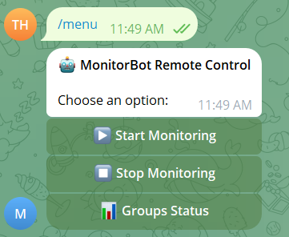
---

### 9.2. Cấu Hình TeleBot

#### Cấu Hình trong appsettings.json

Mở `appsettings.json` và thêm:

```json
{
  "TeleBotConfig": {
    "BotToken": "123456789:ABCdefGHIjklMNOpqrsTUVwxyz",
    "AllowedUsers": [
      "your_telegram_username",
      "admin_username",
      "cto_username"
 ]
  }
}
```

**Quan trọng:**
- `BotToken`: Token nhận từ BotFather
- `AllowedUsers`: Chỉ những username này mới có quyền điều khiển

 

#### Bước 3: Khởi Động Lại MonitorBot

1. Restart MonitorBot application
2. Xem log: "✅ TeleBot started and listening for commands"

---

### 9.3. Sử Dụng TeleBot

#### 9.3.1. Truy Cập Bot

**Cách 1: Private Chat**
1. Mở Telegram
2. Tìm bot của bạn (VD: @managemonitorbot)
3. Click **START** hoặc gửi `/menu`

**Cách 2: Trong Group**
1. Thêm bot vào group
2. Gửi `/menu@managemonitorbot` (với bot username)


---

#### 9.3.2. Menu Chính

Sau khi gửi `/menu`, bạn sẽ thấy:


**Các nút có sẵn:**
- **▶️ Start Monitoring**: Bắt đầu giám sát
- **⏹️ Stop Monitoring**: Dừng giám sát
- **📊 Groups Status**: Xem trạng thái các groups

---

#### 9.3.3. Start/Stop Monitoring

**Start Monitoring:**
1. Click "▶️ Start Monitoring"
2. Bot xác nhận: "✅ Monitoring Started"
3. UI trên máy tính tự động cập nhật

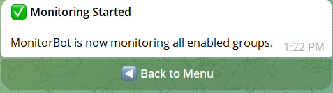

**Stop Monitoring:**
1. Click "⏹️ Stop Monitoring"
2. Bot xác nhận: "⏹️ Monitoring Stopped"
3. UI cập nhật tương ứng

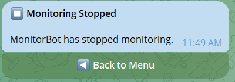

**Logs trên MainForm:**
```
[14:30:25] 🎉 MonitorBot started (via TeleBot)
[14:35:00] ⏹️ MonitorBot stopped (via TeleBot)
```

---

#### 9.3.4. Xem Trạng Thái

**Gửi lệnh:** `/status`

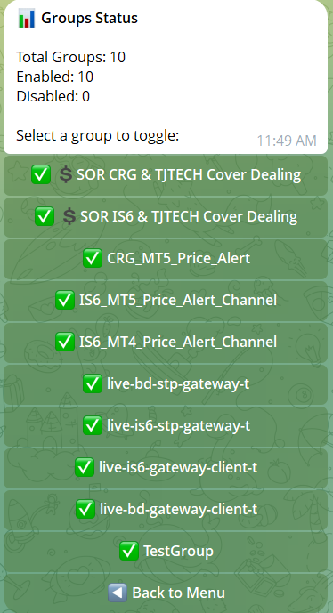

**Thông tin hiển thị:**
- Monitoring: ✅ Running / ⏹️ Stopped
- Total Groups: Tổng số groups
- Enabled Groups: Số groups đang bật
- Disabled Groups: Số groups đã tắt

---

#### 9.3.5. Quản Lý Groups

**Xem danh sách groups:**
1. Click "📊 Groups Status"
2. Bot hiển thị tất cả groups với trạng thái


**Xem chi tiết group:**
1. Click vào tên group
2. Xem thông tin chi tiết:
   - Group Name
   - Group ID
 - Mode (Periodic/Event)
   - Status (Enabled/Disabled)
   - Interval/Timeout settings

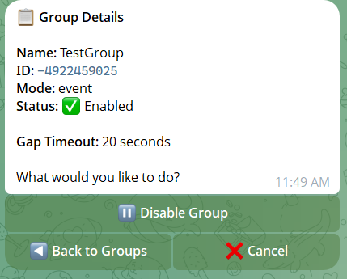

**Enable/Disable Group:**
1. Trong chi tiết group, click:
   - "▶️ Enable Group" (nếu đang disabled)
   - "⏸️ Disable Group" (nếu đang enabled)
2. Bot xác nhận thay đổi
3. Config tự động reload

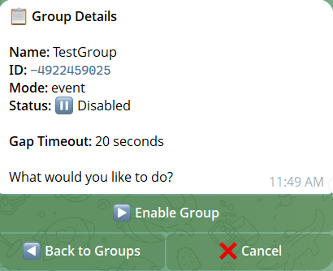

---

### 9.4. Bảo Mật TeleBot

#### 9.4.1. Whitelist Users

Chỉ những users trong `AllowedUsers` mới có quyền:

```json
"AllowedUsers": [
  "admin_user",
  "cto_user",
  "devops_lead"
]
```

#### 9.4.2. Unauthorized Access

Nếu user không có quyền:


Log ghi nhận:
```
[14:30:25] ⚠️ Unauthorized access attempt by @unknown_user
```

#### 9.4.3. Best Practices

✅ **Nên làm:**
- Chỉ thêm users tin cậy vào whitelist
- Sử dụng username Telegram rõ ràng
- Review logs định kỳ
- Giữ Bot Token bảo mật

❌ **Không nên:**
- Share Bot Token công khai
- Thêm quá nhiều users
- Sử dụng bot token của người khác

---

### 9.5. Commands Tham Khảo

| Command | Mô Tả | Ví Dụ |
|---------|-------|-------|
| `/start` | Bắt đầu conversation với bot | `/start` |
| `/menu` | Hiển thị menu chính | `/menu` |
| `/status` | Xem trạng thái monitoring | `/status` |
| `/menu@botname` | Gọi bot trong group | `/menu@managemonitorbot` |

**Trong Group:**
- Phải thêm `@botusername` sau command
- VD: `/menu@managemonitorbot`

**Private Chat:**
- Không cần `@botusername`
- VD: `/menu`

---

### 9.6. Troubleshooting TeleBot

#### 9.6.1. Bot không phản hồi

**Triệu chứng:**
- Gửi `/menu` nhưng không có response

**Giải pháp:**
1. Check log trong MonitorBot: "TeleBot started"
2. Verify Bot Token đúng
3. Check internet connection
4. Restart MonitorBot

#### 9.6.2. Access Denied

**Triệu chứng:**
- Bot reply "Access Denied"

**Giải pháp:**
1. Kiểm tra username Telegram của bạn
2. Verify username trong `AllowedUsers`
3. Đảm bảo không có typo
4. Restart sau khi sửa config

#### 9.6.3. UI không cập nhật

**Triệu chứng:**
- Start/Stop qua bot nhưng UI không đổi

**Giải pháp:**
1. Check logs: Nên thấy "(via TeleBot)"
2. Verify event subscription
3. Restart MonitorBot

#### 9.6.4. Commands trong Group không work

**Triệu chứng:**
- `/menu` trong group không response

**Giải pháp:**
1. Sử dụng `/menu@botusername`
2. VD: `/menu@managemonitorbot`
3. Đảm bảo bot được add vào group

---

### 9.7. Advanced Usage

#### 9.7.1. Multiple Admins

Thêm nhiều admins:

```json
"AllowedUsers": [
  "ceo_username",
  "cto_username", 
  "devops_lead",
  "support_manager",
  "oncall_engineer"
]
```

Mỗi admin có quyền như nhau.

#### 9.7.2. Audit Trail

Tất cả actions qua TeleBot được log:

```
[14:30:25] 📩 Received command '/menu' from @admin_user
[14:30:30] 📲 Callback: 'START_MONITORING' from @admin_user
[14:30:31] ✅ Monitoring started via TeleBot
[14:35:00] 📲 Callback: 'TOGGLE_GROUP:-1001234567890' from @cto_user
[14:35:01] ✅ Group Production Servers toggled to Disabled via TeleBot
```

Review logs để biết:
- Ai làm gì
- Khi nào
- Kết quả ra sao

#### 9.7.3. Integration với Monitoring

TeleBot hoạt động song song với UI:
- Start qua TeleBot → UI update ✅
- Stop qua UI → TeleBot thấy ✅
- State luôn đồng bộ


---

## 10. Xử Lý Sự Cố

### 10.1. Bot Không Kết Nối Telegram

**Triệu chứng:**
- Status: Stopped
- Log: "Error connecting to Telegram"

**Giải pháp:**
1. Kiểm tra internet
2. Kiểm tra API credentials trong `appsettings.json`
3. Xóa file `telegram_session.dat`
4. Khởi động lại và đăng nhập lại

### 10.2. Không Nhận Tin Nhắn

**Triệu chứng:**
- Bot đang chạy nhưng không có log tin nhắn
- Activity Log trống

**Giải pháp:**
1. Kiểm tra GroupId đúng chưa
2. Kiểm tra `IsEnabled: true`
3. Gửi tin nhắn test vào nhóm
4. Xem log có "Message from unconfigured group" không

### 10.3. Không Gọi Điện

**Triệu chứng:**
- Có cảnh báo nhưng không gọi điện
- Log: "Call request queued" nhưng không gọi

**Giải pháp:**
1. Kiểm tra Phone status: **ONLINE** ✅
2. Kiểm tra ContactGroup tồn tại
3. Kiểm tra contacts có số điện thoại
4. Test thủ công: Gọi điện từ phone

### 10.4. TeleBot Không Hoạt Động 🆕

**Triệu chứng:**
- Gửi commands nhưng không có response

**Giải pháp:**
1. Check log: "TeleBot started"
2. Verify Bot Token
3. Check AllowedUsers list
4. Test với `/start` command
5. Restart MonitorBot

---

## 11. FAQ - Câu Hỏi Thường Gặp

### Q1: TeleBot có hoạt động khi MonitorBot đang stopped không? 🆕
**A**: Có! TeleBot luôn hoạt động ngay khi app khởi động, độc lập với trạng thái monitoring.

### Q2: Có thể điều khiển từ nhiều devices không? 🆕
**A**: Có! Mọi device đăng nhập với username được whitelist đều có thể điều khiển.

### Q3: TeleBot có cần internet không? 🆕
**A**: Có. TeleBot cần internet để kết nối Telegram. Monitoring vẫn chạy nếu mất kết nối bot.

### Q4: Commands trong group và private khác nhau không? 🆕
**A**: Trong group cần thêm `@botusername`, trong private không cần.

### Q5: Có giới hạn số lần gọi TeleBot không? 🆕
**A**: Không giới hạn, nhưng Telegram có rate limit. Sử dụng bình thường không vấn đề.

---

## 12. Tips & Best Practices

### 12.1. Remote Control

✅ **Best Practices:**
- Sử dụng TeleBot khi đang di chuyển
- Check `/status` định kỳ
- Enable/Disable groups khi maintenance
- Có ít nhất 2 admins trong whitelist

### 12.2. Bảo Mật

✅ **Security Tips:**
- Không share Bot Token
- Review AllowedUsers định kỳ
- Monitor logs cho unauthorized attempts
- Thay Bot Token nếu bị leak

### 12.3. Monitoring

✅ **Monitoring Tips:**
- Kiểm tra logs cả local và remote actions
- Verify state sync giữa UI và TeleBot
- Test TeleBot trước khi rely hoàn toàn
- Backup config trước khi toggle groups

---

## 13. Changelog

### Version 3.0 (2025-01-22) 🆕
- ✅ **TeleBot Remote Control**
  - Start/Stop monitoring từ xa
  - View groups status
  - Enable/Disable groups
  - Real-time UI synchronization
  - Security với user whitelist
- ✅ State tracking with source info
- ✅ Audit logging cho remote actions
- ✅ Group command support

### Version 2.0 (2025-11-02)
- ✅ Chuyển từ Bot API sang Client API
- ✅ Thêm SMS template tùy chỉnh
- ✅ Cải thiện validation nhóm
- ✅ Hot reload configuration
- ✅ Group settings dialog

### Version 1.0 (2025-10-28)
- 🎉 Phiên bản đầu tiên
- ✅ Giám sát Telegram groups
- ✅ Auto phone calling
- ✅ Contact management
- ✅ Phone setting dialog

---

## 📝 Phụ Lục

### A. Screenshot Placeholders

**Cần thêm các screenshots sau vào `docs/img/`:**

#### Main Interface:
- `mainform-interface.png` - Giao diện chính
- `status-bar.png` - Thanh trạng thái
- `groups-list.png` - Danh sách groups
- `activity-log.png` - Activity log
- `start-monitoring.png` - Start monitoring
- `stop-monitoring.png` - Stop monitoring

#### TeleBot:
- `telebot-overview.png` - Tổng quan TeleBot
- `botfather-create.png` - Tạo bot với BotFather
- `telebot-config.png` - Cấu hình TeleBot
- `telebot-start.png` - Khởi động bot
- `telebot-menu.png` - Menu chính
- `telebot-start-monitoring.png` - Start qua bot
- `telebot-stop-monitoring.png` - Stop qua bot
- `telebot-status.png` - Xem status
- `telebot-groups-list.png` - Danh sách groups
- `telebot-group-detail.png` - Chi tiết group
- `telebot-toggle-group.png` - Toggle group
- `telebot-access-denied.png` - Access denied
- `telebot-ui-sync.png` - UI synchronization

### B. File Locations

| File | Đường Dẫn |
|------|-----------|
| Application | `C:\MonitorBot\MonitorBot.exe` |
| Configuration | `C:\MonitorBot\appsettings.json` |
| Contacts | `C:\MonitorBot\contacts.json` |
| Session | `C:\MonitorBot\telegram_session.dat` |
| Logs | `C:\MonitorBot\logs\` |
| Screenshots | `docs\img\` |

---

*Tài liệu này được cập nhật lần cuối: 22/01/2025*
*Phiên bản: 3.0*
*Framework: .NET 9.0*

---

# 8. Cấu Hình Điện Thoại

### 8.1. Yêu Cầu
- Điện thoại Android
- USB Debugging đã bật
- Cáp USB kết nối

### 8.2. Bật USB Debugging

1. **Bật Developer Options**:
   - Vào **Settings** → **About Phone**
   - Tap **Build Number** 7 lần
   - Nhập mật khẩu (nếu có)


2. **Bật USB Debugging**:
   - Vào **Settings** → **Developer Options**
   - Bật **USB Debugging**
   - Cho phép khi máy tính hỏi


### 8.3. Mở Phone Settings Dialog

**Cách 1: Từ Menu**
1. Menu **Settings** → **Phone Settings**

**Cách 2: Phím tắt**
- Nhấn `Alt+S+P` (nếu đã set shortcut)

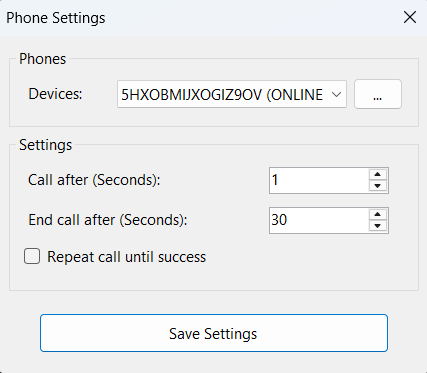

---

### 8.4. Cấu Hình Serial Number

#### Giao Diện Phone Settings Dialog


Dialog hiển thị:
- **Device Serial Number**: Số serial của điện thoại Android
- **Detect Device**: Nút tự động detect device
- **Save**: Lưu cấu hình
- **Cancel**: Hủy và đóng dialog

---

#### Bước 1: Kết Nối Điện Thoại

1. Cắm điện thoại Android vào máy tính qua USB
2. Chọn mode **"File Transfer"** hoặc **"MTP"** trên điện thoại
3. Cho phép USB Debugging khi được hỏi:


   - Tick ☑ **"Always allow from this computer"**
   - Nhấn **OK**

---
 

#### Bước 2: Lưu Cấu Hình

1. Verify serial number đã đúng
2. Click nút **"Save"**
 

3. Thông báo xác nhận:
 

   - "Phone settings saved successfully!"
   - Device sẽ được reload
   - Status bar cập nhật

---

### 8.5. Kiểm Tra Kết Nối

#### Trong Status Bar:


| Trạng Thái | Màu | Ý Nghĩa |
|------------|-----|---------|
| **Phone: ONLINE ✅** | 🟢 Green | Kết nối tốt, sẵn sàng gọi điện |
| **Phone: OFFLINE ❌** | 🔴 Red | Mất kết nối |
| **Phone: Not configured** | ⚪ Gray | Chưa cấu hình |
| **Phone: Device unavailable** | ⚪ Gray | Device không tìm thấy |

---

#### Trong Activity Log:


**Kết nối thành công:**
```
[14:30:25] 📱 Phone connected: 5HXOBM... (ONLINE) ✅
```

**Mất kết nối:**
```
[14:30:25] 📱 Phone disconnected: 5HXOBM... ONLINE → OFFLINE ❌
```

**Thay đổi trạng thái:**
```
[14:30:25] 📱 Phone status changed: 5HXOBM... OFFLINE → ONLINE ✅
```

---

### 8.6. Test Phone Calling

Sau khi cấu hình xong, nên test để đảm bảo gọi điện hoạt động:

#### Bước 1: Chuẩn Bị Test
1. Ensure phone status: **ONLINE ✅**
2. Có ít nhất 1 contact trong Contact Manager
3. Có test group enabled
 

#### Bước 2: Trigger Test Call
1. Gửi tin nhắn STOP vào test group (nếu Event mode)
2. Hoặc đợi timeout (nếu Periodic mode)
3. Hoặc manual trigger qua code

#### Bước 3: Verify Call
**Trên MainForm:**
 

```
[14:35:01] 📞 Call for 'Service Name' queued
[14:35:02] 📞 Calling Manager (0909111111)
```

**Trên Điện Thoại:**
- Màn hình hiển thị cuộc gọi đi
- Số điện thoại của contact
- Tự động end call sau thời gian cấu hình
 

---

### 8.7. Thay Đổi Device

Nếu cần đổi sang điện thoại khác:

1. **Disconnect điện thoại cũ**
   - Rút cáp USB
   - Hoặc disable USB Debugging

2. **Kết nối điện thoại mới**
   - Cắm cáp USB
   - Enable USB Debugging
   - Authorize computer

3. **Cấu hình lại**
 - Mở Phone Settings
   - Click "Detect Device"
   - Lưu serial number mới
 
4. **Verify**
   - Check status bar: ONLINE ✅
   - Check logs: "Phone connected"

---

### 8.8. Xử Lý Lỗi Kết Nối

#### 8.8.1. Lỗi: "Device not found"
 

**Triệu chứng:**
- Click "Detect Device" nhưng không tìm thấy
- Message: "No Android device found"

**Giải pháp:**
1. **Check USB Connection:**
   - Rút và cắm lại cáp USB
   - Thử USB port khác
   - Đảm bảo cáp không bị hỏng

2. **Check USB Mode:**
   - Trên điện thoại, kéo notification bar xuống
   - Chọn "USB for file transfer" hoặc "MTP"
   - Không chọn "Charging only"

3. **Check USB Debugging:**
   - Settings → Developer Options
   - Verify "USB Debugging" đã bật ✅

4. **Restart ADB:**
   ```bash
   adb kill-server
   adb start-server
   adb devices
   ```

5. **Thử Manual:**
   - Run `adb devices` trong command prompt
   - Copy serial number
   - Paste vào Phone Settings dialog

---

#### 8.8.2. Lỗi: "Unauthorized device"
 

**Triệu chứng:**
- Device được detect nhưng status OFFLINE
- Logs: "Unauthorized device"

**Giải pháp:**
1. **Check màn hình điện thoại**
   - Có popup "Allow USB debugging?"
   - Tick ☑ "Always allow from this computer"
   - Nhấn **OK**
 

2. **Nếu không thấy popup:**
   - Settings → Developer Options
   - Scroll xuống "Revoke USB debugging authorizations"
   - Click để reset
   - Rút và cắm lại USB
   - Popup sẽ xuất hiện

3. **Restart ADB và thử lại**

---

#### 8.8.3. Lỗi: "Call failed"
 

**Triệu chứng:**
- Phone status ONLINE
- Nhưng không gọi được điện
- Logs: "Call failed: ..."

**Giải pháp:**
1. **Check Phone Permissions:**
   - Trên điện thoại, vào Settings → Apps
 - Tìm app "Phone" hoặc "Dialer"
   - Check permissions: Phone, Contacts

2. **Check SIM Card:**
   - Đảm bảo SIM card đã lắp
   - Có tín hiệu
   - Có đủ tiền/credit để gọi

3. **Manual Test:**
   - Mở app Phone trên Android
   - Thử gọi thủ công một số
   - Verify điện thoại hoạt động bình thường
 
---

#### 8.8.4. Lỗi: "Device disconnected during call"

**Triệu chứng:**
- Đang gọi điện thì phone mất kết nối
- Call bị interrupt

**Giải pháp:**
1. **Check Cable:**
   - Dùng cáp USB chất lượng tốt
   - Không dùng cáp quá dài
   - Tránh hub USB không ổn định

2. **Power Management:**
   - Windows Settings → Power Options
   - Advanced → USB Settings
   - Disable "USB selective suspend"

3. **Phone Settings:**
   - Tắt "USB Debugging timeout"
   - Disable battery optimization cho system apps

---
 

#### 8.9.3. Auto-Reconnect

MonitorBot tự động:
- ✅ Detect khi device reconnect
- ✅ Retry connection khi mất kết nối
- ✅ Log tất cả state changes
- ✅ Update UI real-time

Không cần manual intervention trong hầu hết trường hợp.

---

### 8.10. Best Practices

#### ✅ Nên làm:
- **Dùng cáp USB tốt** - Cáp chính hãng hoặc chất lượng cao
- **Giữ điện thoại sạc** - Kết nối USB sẽ sạc pin
- **Always allow authorization** - Tick checkbox để không phải authorize lại
- **Stable connection** - Đặt điện thoại ở vị trí cố định
- **Test định kỳ** - Thử gọi test call mỗi tuần
- **Monitor logs** - Check phone status trong activity log

#### ❌ Không nên:
- **Dùng cáp kém chất lượng** - Dễ mất kết nối
- **Rút cắm thường xuyên** - Gây unstable
- **Quên không sạc** - Điện thoại hết pin = không gọi được
- **Ignore errors** - Check logs và fix ngay
- **Multiple devices cùng lúc** - Confusing, chỉ dùng 1
- **Tắt USB Debugging** - App sẽ không hoạt động

---

### 8.11. Troubleshooting Flowchart

```
Phone Status: OFFLINE?
    ↓
├─→ YES → Check USB cable connected? 
│      ↓
│       ├─→ NO → Connect USB → Try again
│    └─→ YES → Check USB Debugging enabled?
│         ↓
│         ├─→ NO → Enable in Developer Options
│  └─→ YES → Check Authorization?
│        ↓
│ ├─→ NO → Allow on phone popup
│        └─→ YES → Restart ADB → Contact Support
│
└─→ NO → Status: ONLINE ✅ → All good!
```

---
  
# 5. Quản Lý Danh Bạ

### 5.1. Mở Contact Manager

**Cách 1: Từ Menu**
1. Menu **File** → **Contact Manager**

**Cách 2: Phím tắt**
- Nhấn `Alt+F+M`

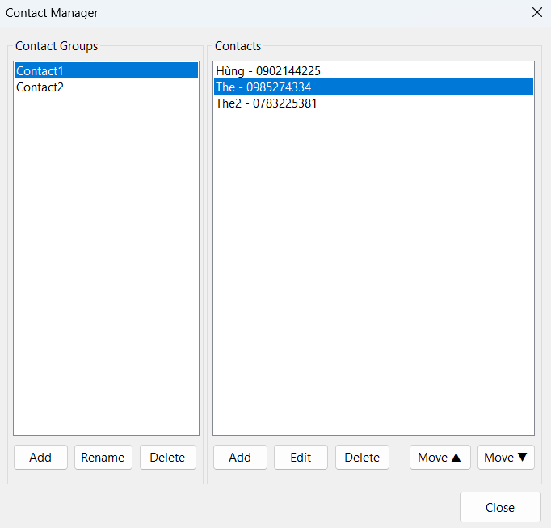

---

### 5.2. Giao Diện Contact Manager


**Layout chính:**
- **Contact Groups** (Bên trái): Danh sách các nhóm liên hệ
- **Contacts** (Bên phải): Danh sách contacts trong nhóm đã chọn
- **Control Buttons**: Các nút thao tác

**Tính năng:**
- ✅ Quản lý nhiều contact groups
- ✅ CRUD operations (Create, Read, Update, Delete)
- ✅ Reorder contacts (Move Up/Down)
- ✅ Auto-save vào file
- ✅ JSON format storage

---

### 5.3. Quản Lý Contact Groups

#### 5.3.1. Thêm Contact Group

**Bước 1: Click nút "Add Group"**


**Bước 2: Nhập tên group**


- Nhập tên có ý nghĩa (VD: "VIP Team", "Support Team")
- Tên không được trống
- Không trùng với group đã có

**Bước 3: Xác nhận**
- Click **OK** để tạo
- Click **Cancel** để hủy


✅ Group mới xuất hiện trong danh sách bên trái

---

#### 5.3.2. Đổi Tên Contact Group

**Bước 1: Chọn group cần đổi tên**


**Bước 2: Click "Rename Group"**


**Bước 3: Nhập tên mới**


- Tên mới không được trống
- Không trùng với groups khác

**Kết quả:**


✅ Tên group được cập nhật
✅ Tất cả group configurations tự động update

---

#### 5.3.3. Xóa Contact Group

**Bước 1: Chọn group cần xóa**

**Bước 2: Click "Delete Group"**


**Bước 3: Xác nhận**


⚠️ **Cảnh báo:**
- Xóa group sẽ xóa tất cả contacts trong đó
- Không thể undo
- Nếu group đang được dùng trong monitoring config, cần update config trước

**Kết quả:**


✅ Group và tất cả contacts bị xóa

---

### 5.4. Quản Lý Contacts

#### 5.4.1. Thêm Contact

**Bước 1: Chọn Contact Group**


- Click vào group muốn thêm contact
- Group được highlight

**Bước 2: Click "Add Contact"**


**Bước 3: Nhập thông tin**


**Thông tin cần nhập:**
- **Name**: Tên người liên hệ
  - Không được trống
  - VD: "CEO", "CTO", "Manager Thế"
  
- **Phone Number**: Số điện thoại
- Format: 10 chữ số
  - VD: `0909111111`, `0123456789`
  - Không cần dấu `+84`

**Validation:**
- ✅ Name không trống
- ✅ Phone phải là số
- ✅ Phone 10 digits
- ❌ Không accept ký tự đặc biệt trong phone

**Bước 4: Xác nhận**
- Click **OK** để thêm
- Click **Cancel** để hủy

**Kết quả:**


✅ Contact mới xuất hiện trong danh sách
✅ Hiển thị: "Name - Phone"
✅ Auto-save vào file

---

#### 5.4.2. Sửa Contact

**Bước 1: Chọn contact cần sửa**


- Click vào contact trong list
- Contact được highlight

**Bước 2: Click "Edit Contact"**


**Bước 3: Sửa thông tin**


- Thông tin hiện tại được pre-fill
- Sửa Name và/hoặc Phone
- Validation tương tự như Add

**Bước 4: Lưu thay đổi**
- Click **OK** để lưu
- Click **Cancel** để hủy

**Kết quả:**


✅ Thông tin contact được cập nhật
✅ Thứ tự không thay đổi

---

#### 5.4.3. Xóa Contact

**Bước 1: Chọn contact cần xóa**

**Bước 2: Click "Delete Contact"**


**Bước 3: Xác nhận**


⚠️ **Lưu ý:** Không thể undo sau khi xóa

**Kết quả:**


✅ Contact bị xóa khỏi group

---

#### 5.4.4. Sắp Xếp Thứ Tự Contacts

**Tại sao quan trọng?**
> Thứ tự trong danh sách = Thứ tự gọi điện khi có alert!


**Ví dụ:**
```
1. CEO - 0909111111        ← Gọi đầu tiên
2. CTO - 0909222222        ← Gọi thứ hai
3. Manager - 0909333333    ← Gọi thứ ba
```

---

**Di Chuyển Contact Lên (Move Up)**

**Bước 1: Chọn contact**


**Bước 2: Click "Move Up"**


**Kết quả:**


✅ Contact di chuyển lên 1 vị trí
✅ Thứ tự gọi điện thay đổi

**Lưu ý:**
- Nút "Move Up" disabled nếu contact đã ở đầu danh sách

---

**Di Chuyển Contact Xuống (Move Down)**

**Tương tự Move Up:**


✅ Contact di chuyển xuống 1 vị trí

**Lưu ý:**
- Nút "Move Down" disabled nếu contact đã ở cuối danh sách

---

### 5.5. Ví Dụ Cấu Hình Thực Tế

#### 5.5.1. Production Environment

**Group: "VIP Team"**


```
1. CEO Nguyễn Văn A - 0909111111
2. CTO Trần Văn B - 0909222222
3. COO Lê Văn C - 0909333333
```

**Khi có alert:**
1. Gọi CEO trước
2. Nếu không trả lời → Gọi CTO
3. Nếu vẫn không trả lời → Gọi COO

---

#### 5.5.2. Development Environment

**Group: "Dev Team"**


```
1. Dev Lead - 0909444444
2. Senior Dev - 0909555555
3. Junior Dev - 0909666666
```

**Escalation:** Lead → Senior → Junior

---

#### 5.5.3. 24/7 Support

**Group: "Support Team"**


```
1. Support Manager - 0909777777
2. On-Call Engineer - 0909888888
3. Backup Support - 0909999999
```

**Rotation:** Manager always first, then on-call rotation

---

### 5.6. Integration với Monitoring

#### 5.6.1. Link Contact Group với Monitoring Group

**Trong Group Configuration:**


```json
{
  "GroupId": -1001234567890,
  "GroupName": "Production Servers",
  "ContactGroup": "VIP Team",  ← Link đến Contact Manager
  // ...
}
```

**Flow:**
```
Alert triggered
    ↓
Load ContactGroup: "VIP Team"
    ↓
Get contacts: [CEO, CTO, COO]
    ↓
Call in order: CEO → CTO → COO
```

---

#### 5.6.2. Xem Contact Group từ Group Details

**Double-click vào Group trong MainForm:**


**Hiển thị:**
- Contact Group name
- Total contacts
- List tất cả contacts với phone numbers
- Thứ tự gọi điện

---

### 5.7. File Storage

#### 5.7.1. Location

**File path:** `contacts.json` (trong thư mục app)


```
MonitorBot/
├── MonitorBot.exe
├── appsettings.json
├── contacts.json      ← Contact data
└── ...
```

---

#### 5.7.2. File Format

**JSON Structure:**


```json
{
  "VIP Team": [
    {
      "Name": "CEO",
 "Phone": "0909111111"
    },
    {
      "Name": "CTO",
      "Phone": "0909222222"
    }
  ],
  "Support Team": [
    {
      "Name": "Support Lead",
      "Phone": "0909333333"
    }
  ]
}
```

**Đặc điểm:**
- ✅ Human-readable
- ✅ Easy to backup
- ✅ Version control friendly
- ✅ Manual edit supported (advanced)

---

#### 5.7.3. Auto-Save

**Behavior:**


- ✅ Mọi thay đổi được lưu ngay lập tức
- ✅ Không cần click "Save" button
- ✅ Safe to close dialog anytime
- ✅ No data loss

**Actions that trigger save:**
- Add/Edit/Delete contact
- Add/Rename/Delete group
- Move contact up/down

---

### 5.8. Best Practices

#### 5.8.1. Naming Conventions

✅ **Tốt:**
```
Group: "Production VIP"
Contacts:
  - CEO Nguyễn Văn A
  - CTO Trần Văn B
  - Manager Lê Văn C
```

❌ **Không tốt:**
```
Group: "G1"
Contacts:
  - A
  - B
  - C
```

**Tips:**
- Tên group rõ ràng, phân biệt environment
- Tên contact có chức danh + tên đầy đủ
- Phone format consistent (10 digits)

---

#### 5.8.2. Contact Order Strategy

**Priority-based:**
```
1. High authority (CEO, CTO)
2. Direct responsible (Manager, Lead)
3. On-call engineer
4. Backup/Secondary
```

**Availability-based:**
```
1. Always available (Manager)
2. Business hours only (Staff)
3. After hours (On-call rotation)
```

**Escalation-based:**
```
1st tier → 2nd tier → 3rd tier
```

---

#### 5.8.3. Multiple Groups Strategy

**By Environment:**
```
- Production VIP
- Staging Support
- Development Team
```

**By Service:**
```
- Database Team
- API Team
- Frontend Team
```

**By Shift:**
```
- Day Shift
- Night Shift
- Weekend On-Call
```

---

#### 5.8.4. Maintenance

**Định kỳ (Hàng tháng):**
- ✅ Verify phone numbers còn active
- ✅ Update personnel changes
- ✅ Review order/priority
- ✅ Test with dummy alerts

**Khi có thay đổi:**
- ✅ Employee join/leave
- ✅ Role changes
- ✅ Phone number changes
- ✅ On-call rotation

---

### 5.9. Validation & Error Handling

#### 5.9.1. Input Validation

**Name validation:**


- ❌ Empty name not allowed
- ❌ Only whitespace not allowed
- ✅ Any characters accepted
- ✅ Unicode supported (Tiếng Việt OK)

**Phone validation:**


- ❌ Empty phone not allowed
- ❌ Non-numeric characters
- ❌ Less than 10 digits
- ❌ More than 11 digits
- ✅ 10 digits: `0909111111`
- ✅ 11 digits: `84909111111`

---

#### 5.9.2. Duplicate Detection

**Group name duplicate:**


```
Error: Group name "VIP Team" already exists
```

**Phone duplicate (warning only):**


```
Warning: Phone number already exists in this group
Continue anyway?
```

---

#### 5.9.3. File Operations Errors

**File locked:**


```
Error: Cannot save contacts.json (file in use)
Close other applications and try again
```

**No write permission:**


```
Error: Access denied to contacts.json
Run as administrator or check file permissions
```

---

### 5.10. Advanced Features

#### 5.10.1. Bulk Import (Manual)

**Có thể edit file `contacts.json` trực tiếp:**

1. Close MonitorBot
2. Edit `contacts.json` với text editor
3. Add multiple contacts
4. Save file
5. Restart MonitorBot

**Example bulk format:**
```json
{
  "New Team": [
    {"Name": "Person 1", "Phone": "0901111111"},
    {"Name": "Person 2", "Phone": "0902222222"},
    {"Name": "Person 3", "Phone": "0903333333"},
    {"Name": "Person 4", "Phone": "0904444444"}
  ]
}
```

⚠️ **Cẩn thận:** Invalid JSON = data loss, backup first!

---

#### 5.10.2. Backup & Restore

**Backup:**
```bash
# Copy file
copy contacts.json contacts.json.backup

# With date
copy contacts.json contacts.json.2025-01-22.backup
```

**Restore:**
```bash
# Restore from backup
copy contacts.json.backup contacts.json

# Or restore specific version
copy contacts.json.2025-01-22.backup contacts.json
```

**Recommended:**
- ✅ Backup before major changes
- ✅ Backup weekly to cloud storage
- ✅ Keep multiple versions
- ✅ Test restore procedure

---

#### 5.10.3. Export/Import (Future Feature)

**Planned features:**
- 📋 Export to CSV
- 📋 Import from CSV
- 📋 Export to Excel
- 📋 Bulk operations

*Currently: Manual JSON editing*

---

### 5.11. Troubleshooting

#### 5.11.1. Contacts không lưu

**Triệu chứng:**
- Thêm contact nhưng sau khi restart mất

**Giải pháp:**
1. Check file permissions
2. Verify `contacts.json` exists
3. Check disk space
4. Close other apps using file
5. Run as administrator

---

#### 5.11.2. File bị corrupt

**Triệu chứng:**
- Error loading contacts
- Cannot open Contact Manager

**Giải pháp:**
1. Check `contacts.json` format (valid JSON?)
2. Restore from backup
3. Delete và tạo lại (nếu không có backup)
4. Check logs: `logs/monitorbot_*.log`

**Validation online:**
- Use https://jsonlint.com
- Paste `contacts.json` content
- Fix errors

---

#### 5.11.3. Gọi điện không theo thứ tự

**Triệu chứng:**
- Order trong UI khác order thực tế call

**Giải pháp:**
1. Verify order trong Contact Manager
2. Close và reopen Contact Manager
3. Check `contacts.json` trực tiếp
4. Restart MonitorBot
5. Check logs để xem actual order

---

### 5.12. Screenshots Checklist

Các screenshots cần thêm vào `docs/img/` cho phần Contact Manager:

- [ ] `contact-manager-menu.png` - Menu item
- [ ] `contact-manager-dialog.png` - Main dialog
- [ ] `contact-add-group-button.png` - Add Group button
- [ ] `contact-add-group-dialog.png` - Add Group input
- [ ] `contact-group-added.png` - Group added success
- [ ] `contact-select-group.png` - Group selected
- [ ] `contact-rename-group-button.png` - Rename button
- [ ] `contact-rename-group-dialog.png` - Rename input
- [ ] `contact-group-renamed.png` - Renamed success
- [ ] `contact-delete-group-button.png` - Delete Group button
- [ ] `contact-delete-group-confirm.png` - Delete confirmation
- [ ] `contact-group-deleted.png` - Group deleted
- [ ] `contact-select-group-for-add.png` - Select group for contact
- [ ] `contact-add-contact-button.png` - Add Contact button
- [ ] `contact-add-dialog.png` - Add Contact input dialog
- [ ] `contact-added.png` - Contact added success
- [ ] `contact-select-to-edit.png` - Select contact to edit
- [ ] `contact-edit-button.png` - Edit button
- [ ] `contact-edit-dialog.png` - Edit dialog
- [ ] `contact-edited.png` - Contact edited success
- [ ] `contact-delete-button.png` - Delete Contact button
- [ ] `contact-delete-confirm.png` - Delete confirmation
- [ ] `contact-deleted.png` - Contact deleted
- [ ] `contact-order-importance.png` - Order importance diagram
- [ ] `contact-select-to-move.png` - Select to move
- [ ] `contact-move-up-button.png` - Move Up button
- [ ] `contact-moved-up.png` - Moved up result
- [ ] `contact-move-down-button.png` - Move Down button
- [ ] `contact-example-vip.png` - VIP Team example
- [ ] `contact-example-dev.png` - Dev Team example
- [ ] `contact-example-support.png` - Support Team example
- [ ] `contact-group-in-config.png` - Contact group in config
- [ ] `group-details-contacts.png` - Group details showing contacts
- [ ] `contact-file-location.png` - File location
- [ ] `contact-json-format.png` - JSON format screenshot
- [ ] `contact-auto-save.png` - Auto-save indicator
- [ ] `contact-name-validation-error.png` - Name validation error
- [ ] `contact-phone-validation-error.png` - Phone validation error
- [ ] `contact-duplicate-group-error.png` - Duplicate group error
- [ ] `contact-duplicate-phone-warning.png` - Duplicate phone warning
- [ ] `contact-file-locked-error.png` - File locked error
- [ ] `contact-no-permission-error.png` - Permission error

**Total Contact Manager screenshots: 40**

---
